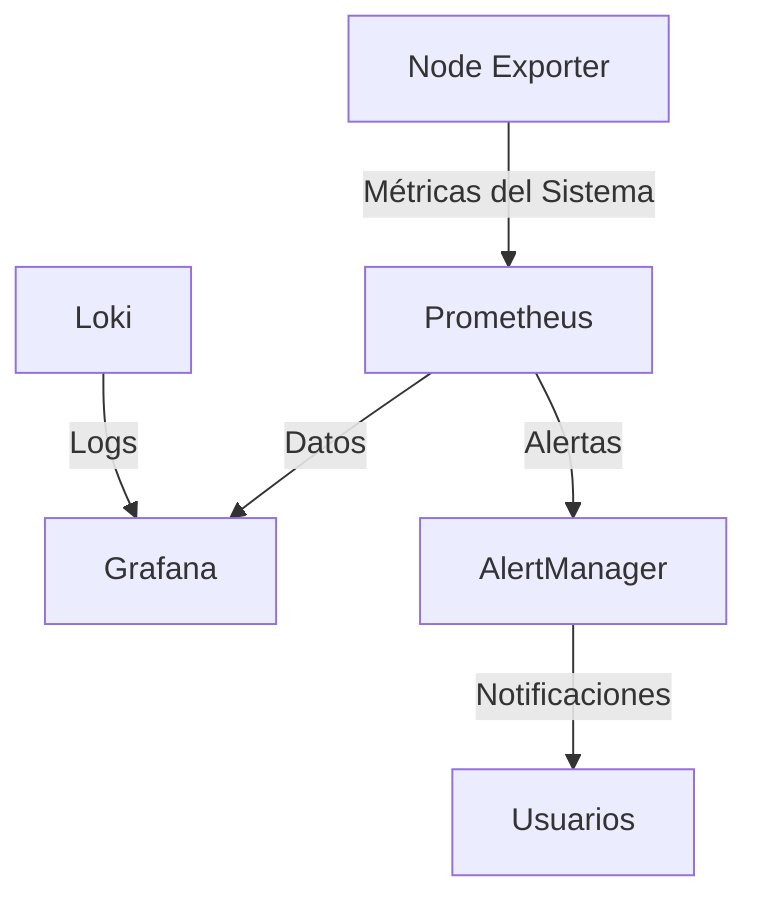

# 🚀 Stack de Monitorización con Prometheus y Grafana

Un stack completo de monitorización implementado con Prometheus, Grafana, Node Exporter, Loki y AlertManager. Esta solución proporciona monitorización en tiempo real, recolección de logs y sistema de alertas.

## 📋 Características

- **Prometheus**: Recolección y almacenamiento de métricas
- **Grafana**: Visualización de datos y dashboards
- **Node Exporter**: Métricas del sistema
- **Loki**: Agregación y consulta de logs
- **AlertManager**: Gestión y notificación de alertas

## 🛠️ Tecnologías Utilizadas

- Docker & Docker Compose
- Prometheus
- Grafana
- Node Exporter
- Loki
- AlertManager

## 📊 Métricas Monitorizadas

- Uso de CPU
- Consumo de Memoria
- Utilización de Disco
- Tráfico de Red
- Latencia de Disco
- Errores de Sistema

## 🏗️ Arquitectura



## 🚀 Instalación

1. **Prerrequisitos**
   ```bash
   - Docker
   - Docker Compose
   - Git
   ```

2. **Clonar el repositorio**
   ```bash
   git clone https://github.com/JulianAlvarez00/monitoring-stack.git
   cd monitoring-stack
   ```

3. **Configurar el entorno**
   ```bash
   # Crear directorios necesarios
   mkdir -p prometheus/config \
            grafana/config \
            alertmanager/config \
            node-exporter/config \
            loki/config
   ```

4. **Iniciar el stack**
   ```bash
   docker-compose up -d
   ```

## 📌 Acceso a las Interfaces

- **Grafana**: http://localhost:3000 
  - Usuario: admin
  - Contraseña: admin
- **Prometheus**: http://localhost:9090
- **AlertManager**: http://localhost:9093
- **Node Exporter**: http://localhost:9100
- **Loki**: http://localhost:3100

## 📊 Dashboards Incluidos

1. **System Overview**
   - Métricas del sistema
   - Uso de recursos
   - Estado del sistema

2. **Network Monitoring**
   - Tráfico de red
   - Errores de red
   - Latencia

3. **Disk Performance**
   - Uso de disco
   - I/O de disco
   - Latencia de disco

## ⚙️ Configuración

### Prometheus
```yaml
# prometheus/config/prometheus.yml
global:
  scrape_interval: 15s
  evaluation_interval: 15s
...
```

### AlertManager
```yaml
# alertmanager/config/alertmanager.yml
global:
  resolve_timeout: 5m
...
```

### Loki
```yaml
# loki/config/loki-config.yml
auth_enabled: false
server:
  http_listen_port: 3100
...
```

## 🔍 Monitorización

El stack proporciona monitorización para:

- Métricas del sistema operativo
- Rendimiento de aplicaciones
- Logs del sistema
- Métricas personalizadas
- Alertas configurables

## 🔔 Alertas

Las alertas están configuradas para:

- Alto uso de CPU (>80%)
- Alto uso de memoria (>85%)
- Disco casi lleno (>85%)
- Errores de red
- Latencia elevada

## 🤝 Contribuir

1. Fork del proyecto
2. Crear una Feature Branch (`git checkout -b feature/AmazingFeature`)
3. Commit de cambios (`git commit -m 'Add some AmazingFeature'`)
4. Push a la Branch (`git push origin feature/AmazingFeature`)
5. Abrir un Pull Request

## 👤 Autor

Tu Nombre
- GitHub: [@JulianAlvarez00](https://github.com/JulianAlvarez00)
- LinkedIn: [JulianAlvarez00](https://linkedin.com/in/JulianAlvarez00)

## 🙏 Agradecimientos

- Documentación oficial de Prometheus
- Comunidad de Grafana
- Stack Overflow
- GitHub Docs

---
⌨️ con ❤️ por [Julian Alvarez](https://github.com/JulianAlvarez00) 😊